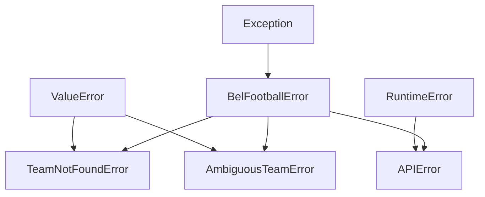

# Usage guide

## Installation

`bel-football` is distributed via GitHub only — there is no PyPI release.

```bash
pip install "git+https://github.com/xtbe/bel-football.git@v0.1.0"
```

Requires Python 3.13+. The only runtime dependency is [`httpx`](https://www.python-httpx.org/).

## Configuration

`BelFootballClient` resolves its base URL from, in priority order:

1. the `base_url` constructor argument
2. the `BEL_FOOTBALL_API_BASE` environment variable
3. `http://localhost:8000`

```python
BelFootballClient()                                    # env var, else default
BelFootballClient(base_url="http://192.168.1.20:9000")  # explicit
BelFootballClient(timeout=30.0)                         # default timeout is 10.0s
```

The library never reads a `.env` file. If you keep configuration in `.env`, load
it in your application before constructing the client:

```python
from dotenv import load_dotenv

load_dotenv()

from bel_football import BelFootballClient
```

A committed `.env.example` documents the expected variable:

```bash
BEL_FOOTBALL_API_BASE=http://localhost:8000
```

## Lifecycle

`BelFootballClient` owns an `httpx.Client` (a connection pool). Close it when
finished — either use it as a context manager, or call `.close()` explicitly:

```python
with BelFootballClient() as client:
    ...

# or
client = BelFootballClient()
try:
    ...
finally:
    client.close()
```

## The team cache

The first call that needs team data fetches `GET /api/teams` once and caches the
result on the client instance. Subsequent name lookups run entirely in memory.
Force a reload (for example after teams change server-side):

```python
client.refresh_teams()
```

The cache is per instance — two `BelFootballClient` objects do not share it.

## Team-name resolution

`resolve_team(query)` normalises the query (lowercase, strip accents, collapse
whitespace) and then tries these stages:

| Stage | Example |
|---|---|
| Exact normalised match | `"KAA Gent"` → KAA Gent |
| Known prefix stripped, then exact | `"gent"` → KAA Gent |
| Every query word appears in the team's words | `"anderlecht"` → RSC Anderlecht |
| Query is a substring of the prefix-stripped name | `"ander"` → RSC Anderlecht |

Known prefixes: `royale`, `royal`, `sporting`, `standard de`, `standard`, `kaa`,
`kvc`, `krc`, `rsca`, `rsc`, `kv`, `sk`, `sv`, `oh`, `stvv`.

The first stage that returns exactly one team wins. A stage that matches two or
more teams raises `AmbiguousTeamError`. No match at any stage raises
`TeamNotFoundError`.

```python
client.resolve_team("gent")        # -> {'id': '1', 'name': 'KAA Gent'}
client.resolve_team("brugge")      # -> AmbiguousTeamError: Club Brugge, Cercle Brugge
client.resolve_team("charleroi?!") # -> TeamNotFoundError
```

## API reference

### `BelFootballClient(base_url=None, *, timeout=10.0)`

Create a client. See [Configuration](#configuration) for `base_url` resolution.

### `client.resolve_team(query: str) -> dict`

Resolve a casual team name to `{"id": ..., "name": ...}`. Raises
`TeamNotFoundError` or `AmbiguousTeamError`.

### `client.get_jupiler_pro_league_standing(team: str, season: str | None = None) -> dict`

Resolve `team`, then return the parsed standing JSON from
`GET /api/teams/{id}/standing`. If `season` is omitted the API returns its latest
available season. Raises the resolver errors, or `APIError` on an HTTP failure.

### `client.refresh_teams() -> None`

Clear the cached team list so the next lookup re-fetches it.

### `client.close() -> None`

Close the underlying HTTP connection pool. Called automatically on context-manager
exit.

### `Team`

Internal frozen dataclass with `id: str` and `name: str` (plus `repr`-hidden
fields used by the resolver). Built from an API payload via `Team.from_api(dict)`,
serialised with `Team.to_dict()`. The client methods return the dict form; `Team`
is exported mainly for type annotations.

## Exception hierarchy



Catch `BelFootballError` to handle every error the package can raise. The leaf
types also subclass a standard-library exception, so existing `except ValueError`
code around the original script keeps working.
